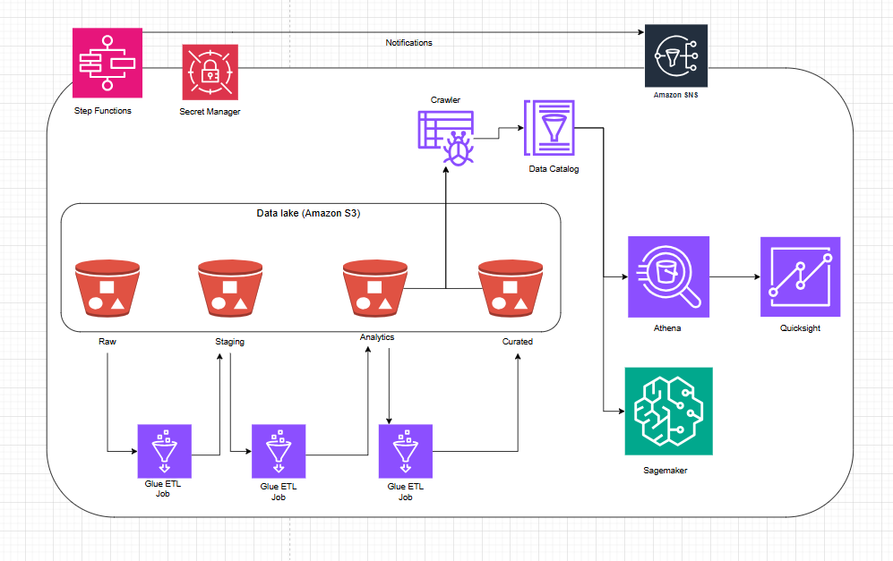
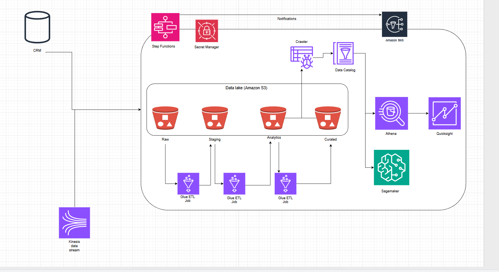

# Crypto Market Data Collectors

Crypto Market Data Collector

This project implements an architecture for near real-time ingestion, storage, and alerting based on cryptocurrency market data from CoinGecko. The system retrieves metrics for BTC, ETH, and ZEC, stores them in PostgreSQL, and generates alerts when price or volume deviates by more than 2% from a rolling 5-minute average.

---

## 🏗 Architecture Diagram



Below is the full end-to-end architecture combining batch, real-time ingestion, data lake, BI, orchestration, and ML workloads:




In this architecture, I rely only on AWS services I have personally used and understand well. Data originates from multiple sources: operational systems such as CRM applications landing in S3, and real-time event streams ingested through Amazon Kinesis. The ingestion layer combines several patterns: Kinesis Data Streams for streaming input, AWS glue for event-driven extraction or API ingestion, and AWS Glue Crawlers to automatically discover schemas and populate the Data Catalog. Workflow orchestration and dependency management are handled through AWS Step Functions. For storage, the system follows a lakehouse pattern using Amazon S3 structured into Raw, Staging, Analytics, and Curated zones, allowing data to mature through quality and transformation steps, with the option to integrate Amazon Redshift for high-performance analytics. Data processing is implemented with AWS Glue ETL jobs using PySpark for batch transformation. Amazon Athena enables SQL queries directly on S3, QuickSight provides dashboards and BI visualization, and Amazon SageMaker supports machine learning workflows on curated datasets. Data testing can be performed using AWS Glue to validate schema consistency, null checks, duplicates, and business rule constraints, while unit tests cover transformation logic in ETL code. Security is enforced through IAM least-privilege roles, centralized secret management via Secrets Manager.
Finally, Amazon SNS delivers pipeline notifications and quality alerts, ensuring the platform is observable, reliable, and suitable for both analytical and operational real-time use cases.

## 📐 Architecture Overview

The system follows a modular, production-ready structure inspired by Clean Architecture:

```
src/
├── clients/                    # External API clients
├── config/                     # Environment configuration via Pydantic
├── database/                   # Engine, session, models, repositories
│   ├── base.py
│   ├── connection.py
│   ├── repository.py
│   └── models/
├── dtos/                       # Data Transfer Objects
├── services/                   # Business logic
└── main.py                     # Application entrypoint
```

### Data Flow

1. `CoinGeckoClient` retrieves market data using `/coins/markets`.
2. Data is converted into a `MarketDataDTO`.
3. `MarketDataRepository` inserts data into PostgreSQL.
4. `AlertEngine` evaluates price/volume changes in real time.
5. Alerts are written to `alerts.txt` using a push-based approach.

---

## 🗂 Folder Structure

```
luxor/
├── docs/
├── src/
│   ├── clients/
│   ├── config/
│   ├── database/
│   ├── dtos/
│   ├── services/
├── tests/
├── docker-compose.yaml
├── Dockerfile
├── Makefile
├── alerts.txt
├── .env.example
└── requirements.txt
└── main.py
```

---

## ⚙️ Running the Project

### 1. Install Dependencies

```
pip install -r requirements.txt
```

### 2. Configure Environment Variables

```
cp .env.example .env
```

Edit the values if needed:

```
DB_HOST=localhost
DB_PORT=5432
DB_USER=postgres
DB_PASSWORD=postgres
DB_NAME=luxor
```

---

## 🐳 Running with Docker

Start PostgreSQL:

```
docker-compose up -d
```

Check running containers:

```
docker ps
```

---

## ▶️ Start the Application

```
python main.py
```

This will:

- Fetch crypto market data
- Insert rows into PostgreSQL
- Generate alerts into `alerts.txt`
- Run at 1Hz internal frequency

---

## 🗄 Viewing Database Records

Enter PostgreSQL container:

```
docker exec -it luxor_postgres psql -U postgres -d luxor
```

List records:

```
SELECT * FROM historical_market_data ORDER BY timestamp DESC LIMIT 20;
```

---

## 🔥 Alert System

Alerts trigger when either:

- Price changes > 2%
- Volume changes > 2%

Compared to a 5‑minute rolling window (300 samples).

Alerts are immediately appended to `alerts.txt`.

---

## 🧪 Tests

```
pytest -q
```

---

## 🧩 Extensibility: How to Extend the App

### Describe how can this app be extended to different metrics, assets or purposes?

The application is designed to be easily extensible thanks to its modular and layered architecture. To support new metrics, you can simply update the DTOs and database schema, and the rest of the pipeline (repository, services, and alert engine) adapts without major changes. Adding new assets is straightforward just include them in the client request or create additional client classes if integrating other data providers. The alert engine is also extensible: new alert rules can be introduced by adding additional strategy classes or rule evaluators. Finally, the system supports multiple output mechanisms, so extending alerts to Kafka, AWS SNS/SQS, Webhooks, or S3 is as simple as implementing additional writers or publishers while keeping the core logic untouched.

---

## 🚀 Scalability Considerations

As the volume of historical market data grows, the database may experience performance degradation. To ensure the system can scale without losing information, several strategies can be implemented. First, partitioning either by month or by asset_id improve the query performance by keeping each partition small and manageable. Second, older data can be offloaded to OLAP-optimized storage such as sypnase, redshift or even Parquet files in S3 which are ideal for analytical workloads while keeping PostgreSQL lightweight for recent data.

## ⚙️ Performance Optimizations

To optimize query performance, an essential step is adding an index on (asset_id, timestamp DESC) having both index this allow enabling fast retrieval of the latest records for each asset.

---

## 📝 Trade‑offs & Decisions

The architecture was kept simple and modular, prioritizing maintainability and clarity. The codebase is organized into independent layers: API client, DTOs, repository, services, which makes it easy to replace or extend components without impacting the rest of the system. SQLAlchemy was chosen for database access because it provides a clean abstraction layer, even if raw SQL could offer higher performance at extreme scale.

Deploying the system in Docker containers simplifies local reproducibility and mirrors a real production workflow. By containerizing both the application and PostgreSQL, the entire service becomes portable and easy to run in any environment. This design also makes it straightforward to deploy to cloud environments such as AWS ECS, Azure Container Apps, etc. Each component, the app, the database, and eventually a message broker can run as an independent container, enabling scaling and isolation.

With more time, the architecture could be further decoupled by moving alert outputs from a local file to a messaging system such as Kafka, RabbitMQ, AWS SQS, etc. This would allow multiple consumers (dashboards, monitoring services, downstream analytics) to process alerts independently. The ingestion container could also be scaled horizontally by partitioning responsibilities, for example, one container per asset or per metric while the alert engine could run as its own microservice.

Future improvements could include adding asynchronous requests to reduce latency, implementing retry/backoff logic, adding observability tooling, or introducing database partitioning.
